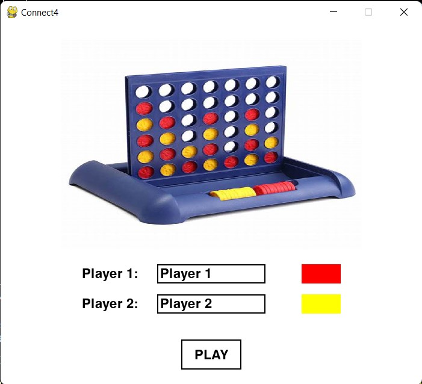
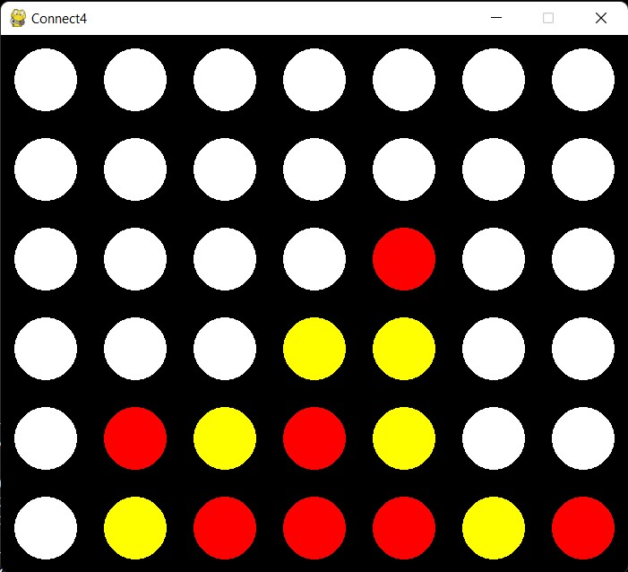
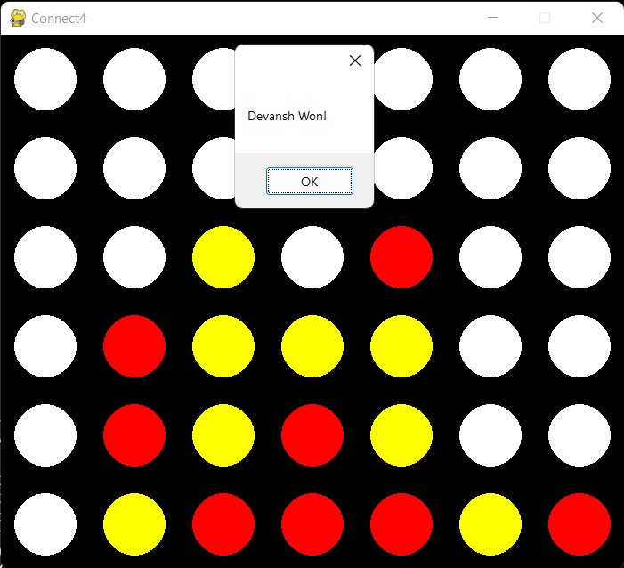

# Connect4

<<<<<<< HEAD
This is a computer game based on the 2-Player Connection Board Game 'Connect4', created using Python, Pygame and Pyautogui.
=======
This is a To-Do List creating website, made using Python, Flask, HTML, CSS, JScript and JQuery.
>>>>>>> 9ada5d106b0f136fd64276464ca552d2d8950836


## How to install and Run
Firstly setup a Virtual Environment by following the below steps:
1. Open Windows Powershell with Run as Administrator, and enter command ``` Set-ExecutionPolicy RemoteSigned ```.
2. Then install virtualenv, by using command ``` pip install virtualenv ```.
3. Go to the folder, where you want to create the folder for your website. (Let it be named as 'VirtualEnv' (You can choose any name!)).
4. Open Windows Powershell in that folder and run command ``` virtualenv <folder_name> ``` (Let <folder_name> be 'venv_folder').
5. Go inside the new folder created (venv_folder) by running command ``` cd <folder_name> ```.
6. Then run command ``` ./Scripts/activate ```. This will allow you to enter a functional virtual environment.
7. Then download the zip file of the code, and extract the zip inside this folder (<folder_name>, here 'venv_folder').


Then run the below commands:

```
pip install -r requirements.txt

```

<<<<<<< HEAD


## How to use
1. After you run the above mentioned commands, run the ```main.py``` file.
2. A home-page window will open on the screen, where you can enter the names of Players (by default, ther are Player 1 (red color) and PLayer 2 (yellow color)).
3. Once you enter the corresponding names (not mandatory to change the default names), you are all set to play the game.
4. You can start the game by clicking on the ```PLAY``` button.
5. Now you will be presented with the main game-play region, a screen representing the 6x7 board of acutal board-game.
6. Both the players can move as per the rules of the game as mentioned here: .
7. Now enjoy the game!
=======
So you can access in the local URL: _[localhost:5000](localhost:5000/)_


## How to use
1. After you run the above mentioned commands, go to the local host.
2. There will be a text-box in the centre of the screen,where you have to enter your task and add it's deadline in the below 'Deadline' section.
3. Once you enter both the things, click on the 'Add' button present on the screen. 
4. Once a task has been added successfully, a pop-up will be shown to confirm the same; otherwise if there is any mistake in the entered information, an alert will be shown.
5. A table (representing the To-Do List) will be present on the screen which will contain details of all the successfully-added tasks, along with a check-box for each task, to show it's status (If completed then checked, otherwise unchecked).
6. Also, you will be able to see the most urgent tasks (deadline within 2 hours) with red background, then comparitively low priority tasks (dealdline within 2-6 hours) with yellow background, and least priority tasks with light-purple background.
7. Once the deadline for a particular task is crossed, it will be removed from the To-Do List.
>>>>>>> 9ada5d106b0f136fd64276464ca552d2d8950836


## Libraries Used

<<<<<<< HEAD
* pygame == 2.1.2
* numpy == 1.22.3
* pyautogui == 0.9.53
* Python==3.9.0
=======
* Python==3.9.0
* Flask==2.1.2
* Werkzeug==2.1.2
* BootStrap
* JQuery
* JScript
>>>>>>> 9ada5d106b0f136fd64276464ca552d2d8950836


## Screen Shots

__Home Page__
<<<<<<< HEAD


__Names Entered__


__Game Board__


__Winning Situation__

=======


__Successful Addition__


__Unsuccessful Addition__

>>>>>>> 9ada5d106b0f136fd64276464ca552d2d8950836
